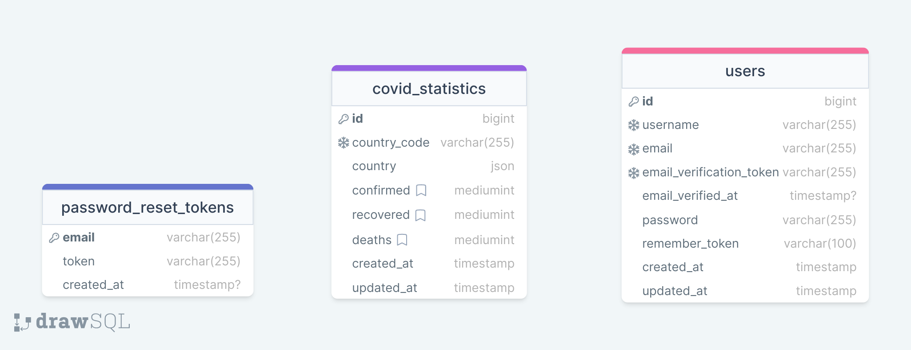

# Coronatime
#### Author: [Davit Shkubuliani](https://www.linkedin.com/in/davit-shkubuliani/)

--- 

Coronatime is a Laravel-based web application that allows users to register and receive email verification to confirm their email address.
Upon verification, users can access the website's features by logging in. Users can reset their passwords in case they forget them.

When logging in, users have the option to choose to be remembered by checking the "remember me" checkbox. Once they log in, they can access two pages that provide them with COVID-19 statistics.
The first page displays global statistics of confirmed, recovered, and deaths cases of worldwide. The second page shows country-specific statistics.
Additionally, the application features a custom artisan command that updates the COVID-19 statistics daily. Also application has a 100% test coverage to ensure that the application runs smoothly and efficiently.

The application supports two languages, Georgian and English.

#
## Table of Contents

* [Prerequisites](#prerequisites)
* [Getting Started](#getting-started)
* [Configuration](#configuration)
* [Development](#development)
* [Database Structure](#database-structure)
* [Live Deployment](#live-deployment)


#
## Prerequisites

* &nbsp;&nbsp;*PHP@8.2 and up*
* &nbsp;&nbsp;*MYSQL@8 and up*
* &nbsp;&nbsp;*npm@6 and up*
* &nbsp;&nbsp;*composer@2.4 and up*


#

## Tech Stack
- &nbsp;[Laravel@10.x](https://laravel.com/docs/8.x) - back-end framework
- &nbsp;[TailwindCSS](https://tailwindcss.com/) - css framework for styles
- &nbsp;[Spatie Translatable](https://github.com/spatie/laravel-translatable) - package for translation


#
## Getting Started
1. First of all you need to clone repository from github:
    ```sh
    git clone https://github.com/RedberryInternship/data-shkubuliani-coronatime.git
    ```

2. Next step requires you to run *composer install* in order to install all the dependencies.
    ```sh
    composer install
    ```

3. after you have installed all the PHP dependencies, it's time to install all the JS dependencies:
    ```sh
    npm install
    ```

   and also:
    ```sh
    npm run dev
    ```


4. Now we need to set our env file. Go to the root of your project and execute this command.
    ```sh
    cp .env.example .env
    ```


#
## Configuration

1. Modify the database configuration in your `.env` file. DB_PASSWORD is empty by default.
   >DB_CONNECTION=mysql

   >DB_HOST=127.0.0.1

   >DB_PORT=3306

   >DB_DATABASE=*****

   >DB_USERNAME=*****

   >DB_PASSWORD=*****

2. Run database migrations:
    ```shell
    php artisan migrate:fresh
    ```

3. Modify the email configuration in your `.env` file.
   >MAIL_DRIVER=smtp

   >MAIL_HOST=smtp.gmail.com

   >MAIL_PORT=465

   >MAIL_USERNAME=*****

   >MAIL_PASSWORD=*****

   >MAIL_ENCRYPTION=ssl

   >MAIL_FROM_NAME=Coronatime

#
## Development

You need to start both Laravel and Vite servers:

```shell
php artisan serve
```

```shell
npm run dev
```


#
## Database Structure
[*drawSQL link*](https://drawsql.app/teams/datas-team/diagrams/coronatime)




#
## Live Deployment

https://coronatime.data-shkubuliani.redberryinternship.ge/
